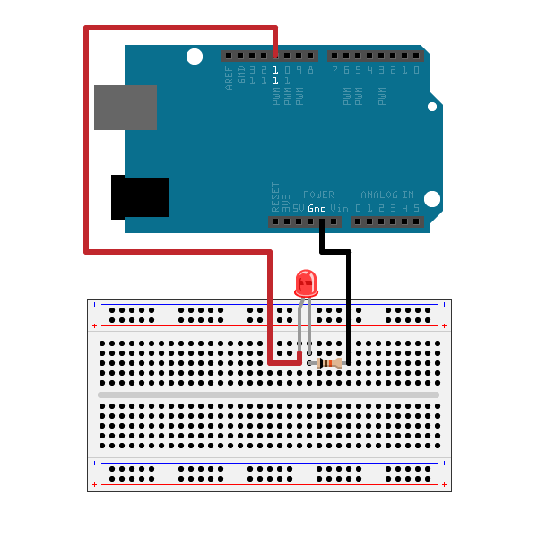

# <span style="color:rgb(213,80,0)">Project\-Based Learning with Low\-Cost Hardware using MATLAB</span>

# Overview

This webinar is designed for educators aiming to enrich project-based learning experiences by integrating affordable hardware with MATLAB®. Participants will explore practical strategies for utilizing MATLAB Mobile for sensor data acquisition, interfacing webcams for image and video processing, and connecting to cloud-based platforms like ThingSpeak for IoT applications. The session will also cover hands-on integration with popular hardware platforms such as Raspberry Pi and Arduino, demonstrating how these tools can be seamlessly connected to MATLAB to create interactive, real-world projects. Attendees will gain insights into setting up and managing low-cost hardware in both classroom and remote learning environments, enabling engaging, scalable, and accessible project-based activities without the need for expensive lab infrastructure or complex software installations.


## Technical Requirements

It is recommended that Google Chrome™ be used for this workshop.

## Material Requirements

If you would like to follow along with all of the workshop activities, a basic Arduino kit is required. The below links are some options that are available online.


[<u>ELEGOO Super Starter Kit</u>](https://www.amazon.com/ELEGOO-Project-Tutorial-Controller-Projects/dp/B01D8KOZF4/ref=asc_df_B01D8KOZF4/?tag=hyprod-20&linkCode=df0&hvadid=693369603351&hvpos=&hvnetw=g&hvrand=12451674447145320957&hvpone=&hvptwo=&hvqmt=&hvdev=c&hvdvcmdl=&hvlocint=&hvlocphy=9001873&hvtargid=pla-406302474425&psc=1&mcid=80a5b47d61dc377992c3c25d65d73272)


[<u>Arduino Starter Kit</u>](https://store.arduino.cc/products/arduino-starter-kit-multi-language?srsltid=AfmBOoo8ChxKlB7y5MEod3Eek5t9001C-l_8_YQT77jxbHOjEc_IE9ac)


# Getting Started
### 1. Create a MathWorks Account

Click on the link below to create a MathWorks account if you do not already have one:


[<u>https://www.mathworks.com/mwaccount/account/create</u>](https://www.mathworks.com/mwaccount/account/create)


Troubleshooting:


[<u>https://www.mathworks.com/matlabcentral/answers/361072\-how\-do\-i\-create\-a\-mathworks\-account</u>](https://www.mathworks.com/matlabcentral/answers/361072-how-do-i-create-a-mathworks-account)

### 2. Download MATLAB Mobile

Scan the QR code below to download the app on your smart device:

<p style="text-align:left">
   
</p>


### 3. Install MATLAB Connector

Follow the instructions at the link below to install MATLAB Connector, which allows you to interface your Arduino hardware with MATLAB Online:

   https://www.mathworks.com/products/matlab-drive.html?s_tid=AO_MLConnector#matlab-drive-connector

### 4. Configure MATLAB Connector for Arduino Hardware

*Unlike MATLAB Desktop, the MATLAB and Simulink Support Packages for Arduino are automatically installed on MATLAB Online.*

-  After you have successfully installed MATLAB Connector, plug in your Arduino board.
- Log in to MATLAB Online and run the following command in the Command Window:
```Matlab
arduinosetup
```
- Follow the instructions, accepting the default libraries.
- When complete, run the following command and ensure the status of your board is *"Ready to connect"*:
```Matlab
arduinolist
```

**You will see an error in MATLAB Online when running Arduino commands if your region is not yet ready for this feature.**

**Arduino support for EDU customers will be rolled out in all regions in a future update to 2024b**

### 5. Clone this Repository to your MATLAB Drive

Click the button below to clone the repository for this workshop to your MATLAB Drive to use in MATLAB Online.


[](https://matlab.mathworks.com/open/github/v1?repo=mathworks/Low-Cost-Hardware-with-MATLAB-Online&project=low-cost-hw-mlo.prj&file=README.mlx) 

# Activities
### Demo 1: Advanced Arduino Control
<p style="text-align:left">
   
</p>


[<u>https://www.mathworks.com/help/matlab/supportpkg/iot\-automatic\-cooling\-fan\-arduino\-example.html</u>](https://www.mathworks.com/help/matlab/supportpkg/iot-automatic-cooling-fan-arduino-example.html)

### Demo 2: [Collecting Smartphone Sensor Data](https://matlab.mathworks.com/open/github/v1?repo=mathworks/Low-Cost-Hardware-with-MATLAB-Online&project=low-cost-hw-mlo.prj&file=PlotLiveAccelerationDatafromMATLABMobile.mlx)
<p style="text-align:left">
   
</p>


[https://www.mathworks.com/help/matlabmobile/ug/sensor\-data\-collection\-with\-matlab\-mobile.html](https://www.mathworks.com/help/matlabmobile/ug/sensor-data-collection-with-matlab-mobile.html)

### Activity 1: [Taking a Selfie Using a Webcam](https://matlab.mathworks.com/open/github/v1?repo=mathworks/Low-Cost-Hardware-with-MATLAB-Online&project=low-cost-hw-mlo.prj&file=TakingaSelfieUsingaWebcam.mlx)
<p style="text-align:left">
   
</p>


### Activity 2: [Plot Traffic Data Using ThingSpeak](https://matlab.mathworks.com/open/github/v1?repo=mathworks/Low-Cost-Hardware-with-MATLAB-Online&project=low-cost-hw-mlo.prj&file=UseAreaPlotToCompareTrafficDataSetsTSExample.mlx)
<p style="text-align:left">
   
</p>


### Demo 3: [Controlling an LED using MATLAB Online and Arduino](https://matlab.mathworks.com/open/github/v1?repo=mathworks/Low-Cost-Hardware-with-MATLAB-Online&project=low-cost-hw-mlo.prj&file=ArduinoGettingStartedExample.mlx)
<p style="text-align:left">
   
</p>


# License

The license for this module is available in the [LICENSE.txt](https://github.com/mathworks/Low-Cost-Hardware-with-MATLAB-Online/blob/main/LICENSE.txt)


## Products

MATLAB®, Image Processing Toolbox

# Educator Resources

[<u>https://www.mathworks.com/academia.html</u>](https://www.mathworks.com/academia.html)

-  Access tools and resources for delivering great MATLAB based courses, including lectures, project\-based learning, and assessments 
-  Browse courseware and examples from MathWorks and educators 

[<u>https://www.mathworks.com/hardware\-support/arduino.html</u>](https://www.mathworks.com/hardware-support/arduino.html)

-  Get support for MATLAB, Simulink, and hardware support packages 
-  Contact your Customer Success team for assistance with curriculum 

[<u>https://github.com/mathworks</u>](https://github.com/mathworks) [<u>https://github.com/MathWorks\-Teaching\-Resources</u>](https://github.com/MathWorks-Teaching-Resources)

# Additional Resources
### MATLAB Mobile

[<u>https://www.mathworks.com/help/matlabmobile/matlab\-mobile\-fundamentals.html</u>](https://www.mathworks.com/help/matlabmobile/matlab-mobile-fundamentals.html)

### Webcams

https://www.mathworks.com/help/matlab/cameras-and-mobile-sensing.html

### ThingSpeak

https://www.mathworks.com/help/thingspeak/

### Arduino

[<u>https://www.mathworks.com/help/matlab/examples.html?category=arduinoio&exampleproduct=all&newonly=&s\_tid=CRUX\_lftnav</u>](https://www.mathworks.com/help/matlab/examples.html?category=arduinoio&exampleproduct=all&newonly=&s_tid=CRUX_lftnav)
https://www.mathworks.com/help/matlab/supportpkg/using-arduino-explorer.html

### Raspberry Pi

[<u>https://www.mathworks.com/help/matlab/supportpkg/connect\-to\-raspberry\-pi\-hardware\-board\-in\-matlab\-online.html</u>](https://www.mathworks.com/help/matlab/supportpkg/connect-to-raspberry-pi-hardware-board-in-matlab-online.html) 

[<u>https://www.mathworks.com/help/matlab/examples.html?category=raspberrypiio&exampleproduct=all&newonly=&s\_tid=CRUX\_lftnav</u>](https://www.mathworks.com/help/matlab/examples.html?category=raspberrypiio&exampleproduct=all&newonly=&s_tid=CRUX_lftnav)


 *©* Copyright 2024 The MathWorks™, Inc

